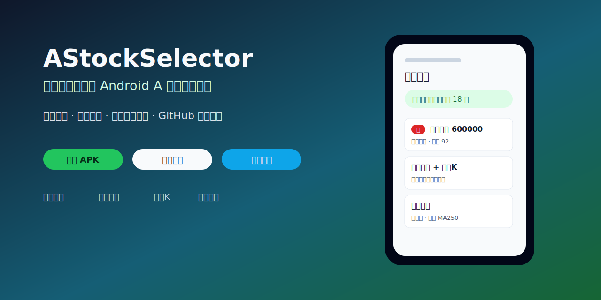
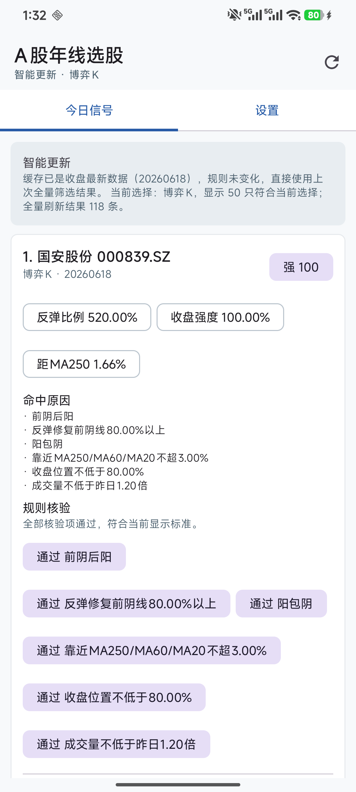
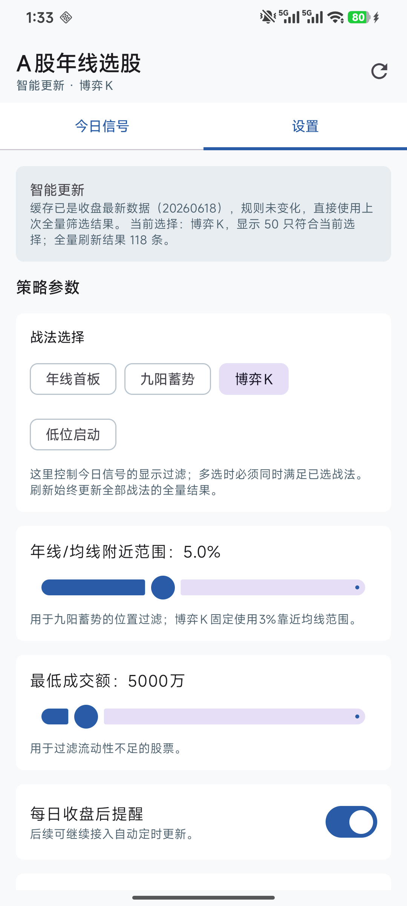
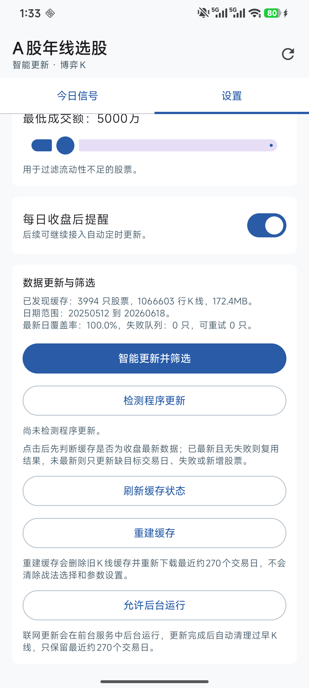
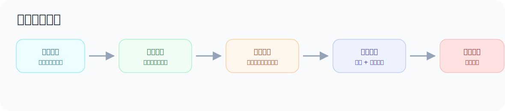

# AStockSelector - A 股策略选股器

[](https://github.com/qwertasdfg77/AStockSelector/actions/workflows/android-ci.yml)
[](https://github.com/qwertasdfg77/AStockSelector/actions/workflows/release-apk.yml)
[](https://github.com/qwertasdfg77/AStockSelector/releases/latest)
[](LICENSE)
[](https://developer.android.com/)
[](README.md)

面向中文用户的开源 Android A 股日线选股工具。它在手机端读取沪深 A 股列表和日 K 数据，维护本地缓存，并按预设战法筛选“今日信号”。

> 本项目只用于学习、复盘和策略研究，不构成投资建议，不接入券商交易，不提供自动下单能力。



## 快速入口

- 下载 APK：[GitHub Releases](https://github.com/qwertasdfg77/AStockSelector/releases/latest)
- 项目主页：[GitHub Pages](https://qwertasdfg77.github.io/AStockSelector/)
- 安装说明：[docs/install.md](docs/install.md)
- 常见问题：[FAQ.md](FAQ.md)
- 策略规则：[docs/strategy-rules.md](docs/strategy-rules.md)
- 数据源说明：[docs/data-sources.md](docs/data-sources.md)
- 正式签名 APK：[docs/signing-release.md](docs/signing-release.md)
- 真实截图采集：[docs/screenshots.md](docs/screenshots.md)

## 界面预览

| 今日信号 | 策略参数 | 数据更新 |
| --- | --- | --- |
|  |  |  |



> 上方为真实手机截图；股票结果只代表截图时的本地缓存筛选结果，不构成投资建议。

## 项目特点

- 纯 Android 端运行，Kotlin + Jetpack Compose。
- 支持手机端联网更新 A 股列表和日 K 数据。
- 新浪数据源优先，腾讯数据源备用。
- 本地 SQLite 缓存，默认保留约 270 个交易日。
- 智能更新：先判断缓存是否为收盘最新数据，再只补缺目标交易日、失败或新增的股票。
- 失败队列：失败股票会持久保存，缓存已最新时只补失败股票，并限制当天重复重试。
- 本地筛选：只读取筛选必需窗口，先粗筛候选，再并行计算候选股票。
- 今日信号持久保留，重新打开 App 不清空。
- 新入选股票置顶，并显示红底白字“新”标识。
- 多选战法按“且”筛选，同一股票多战法命中会合并显示。
- 支持 GitHub 更新检测。

## 当前版本

- App 版本：`0.2.6`
- Android `versionCode`：`18`
- minSdk：`26`
- targetSdk：`35`
- compileSdk：`35`

## 已实现预设战法

### 年线首板

关注接近涨停、上穿或靠近 MA250、近期无涨停、量能和成交额达标、非一字板的首板类信号。

### 九阳蓄势

关注 9 日多阳、涨幅不过热、靠近 MA250、MA250 走平或向上、当前仍在年线上的蓄势信号。

### 博弈K

关注前阴后阳、反弹修复前阴线 80% 以上、阳包阴、靠近均线、收盘强、量能不萎缩的博弈 K 线。

### 低位启动

关注距 120 日低点较近、低点不再明显下移、20 日振幅收敛、站上 MA20、靠近 MA60、放量阳线、接近 20 日高点的低位启动信号。

完整规则见：[docs/strategy-rules.md](docs/strategy-rules.md)

## 数据更新逻辑

```text
点击“智能更新并筛选”
-> 判断目标收盘交易日
-> 检查本地缓存 latest date
-> 缓存最新、规则未变化且无失败：复用上次全量筛选结果
-> 缓存过期：只更新缺目标交易日的股票
-> 缓存最新但有失败：只补失败股票
-> 新增股票或历史不足：补最近约 270 个交易日
-> 清理过早 K 线，只保留约 270 个交易日
-> 本地筛选并刷新今日信号
```

数据源说明见：[docs/data-sources.md](docs/data-sources.md)

## 本地构建

推荐使用 Android Studio 打开本仓库根目录，等待 Gradle Sync 完成后运行 `app`。

命令行构建需要本机已经安装：

- JDK 17
- Android SDK 35

```powershell
.\gradlew.bat --no-daemon :app:assembleDebug
```

或者在 Windows 上运行：

```powershell
.\build-debug-apk.bat
```

> 仓库不会提交 `local.properties`。如果使用命令行构建，请在本机自行配置 `ANDROID_HOME` / `ANDROID_SDK_ROOT`，或由 Android Studio 自动生成 `local.properties`。

## 自动 Release 构建

仓库包含 GitHub Actions：

- `android-ci.yml`：每次推送和 PR 自动检查版本元数据、运行单元测试并构建 debug APK。
- `release-apk.yml`：推送 `v*` tag 后自动构建 APK、生成中文 Release 说明，并同步更新 App 内更新服务仓库。

如果仓库配置了正式签名密钥，`release-apk.yml` 会同时生成正式签名 APK，并优先把正式签名 APK 写入更新服务。签名配置见：[docs/signing-release.md](docs/signing-release.md)

## 下载 APK

当前 GitHub Release：

- <https://github.com/qwertasdfg77/AStockSelector/releases/latest>

当前 App 内更新服务仓库：

- <https://github.com/qwertasdfg77/astock-selector-updates>

App 内“检测程序更新”会读取：

- <https://raw.githubusercontent.com/qwertasdfg77/astock-selector-updates/main/latest.json>

## 文档

- [产品需求文档 PRD](docs/AStockSelector_PRD.pdf)
- [数据库完整 SQL](docs/AStockSelector_schema.sql)
- [安装说明](docs/install.md)
- [常见问题](FAQ.md)
- [策略规则](docs/strategy-rules.md)
- [数据源说明](docs/data-sources.md)
- [正式签名 APK](docs/signing-release.md)
- [真实截图采集](docs/screenshots.md)
- [开发路线图](ROADMAP.md)
- [免责声明](DISCLAIMER.md)
- [隐私说明](PRIVACY.md)

## 适合谁

- 想学习 Android + Kotlin + Compose 的中文开发者。
- 想研究 A 股日线选股规则、本地缓存和策略筛选的个人用户。
- 想基于开源代码继续改造自用股票筛选工具的人。

## 不适合谁

- 需要实时行情、分时数据或 Level-2 数据的人。
- 需要自动交易、券商接口或量化回测平台的人。
- 希望软件直接给出买卖建议的人。

## 开源协议

本项目采用 MIT License。详见 [LICENSE](LICENSE)。
